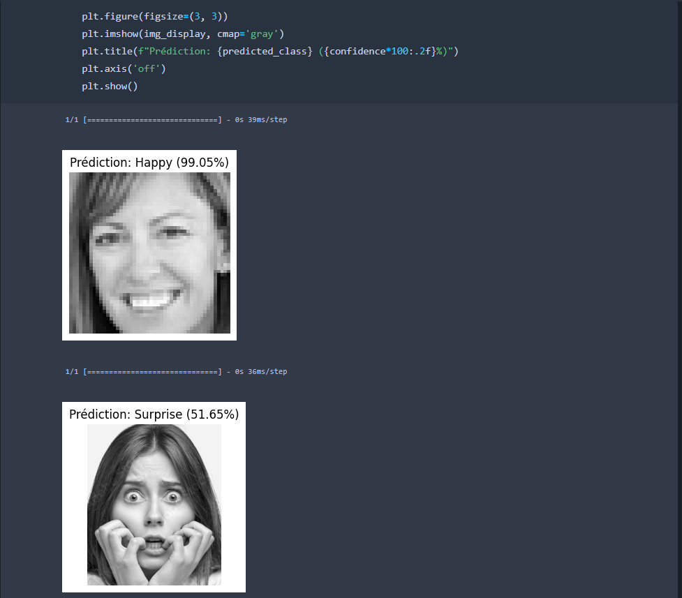

# Emotion_detection_CNN  
Emotion recognition using convolutional neural network image classification.

This code implements an image classification model for emotion recognition using a Convolutional Neural Network (CNN) in Keras. It begins by preparing the training and validation datasets using `ImageDataGenerator` to perform preprocessing and augmentation, such as rescaling pixel values, applying random rotations, shearing, zooming, and horizontal flips to improve model generalization. Images are loaded in grayscale and resized to 48×48 pixels to match the input shape required by the model. The architecture consists of multiple convolutional layers that progressively learn hierarchical features from the input images, starting with 32 filters and increasing to 64, 128, and finally 256 filters for deeper feature extraction. Max-pooling layers reduce the spatial dimensions, and dropout layers are used after certain layers to reduce overfitting. After flattening the extracted feature maps, a dense layer with 512 neurons is added for high-level reasoning, followed by a softmax output layer with 7 neurons representing the emotion classes: Angry, Disgust, Fear, Happy, Neutral, Sad, and Surprise.

The model is compiled using the Adam optimizer, categorical cross-entropy loss (suitable for multi-class classification), and accuracy as a performance metric. It is trained over 30 epochs with `steps_per_epoch` and `validation_steps` determined by the dataset size and batch size. During training, the model learns to minimize the loss on the training data while also monitoring performance on the validation set. After training, the code plots both the loss and accuracy curves for training and validation, helping to visualize learning progress and potential overfitting. Finally, the trained CNN model is saved in `.keras` format for future use, allowing it to be reloaded and applied to new images for emotion recognition without retraining.

---

## Example Test

Below is an example test where the model predicts the emotion from a grayscale image.

### Test Image  



---

### Test Code

```python
from keras.preprocessing import image
import numpy as np
import matplotlib.pyplot as plt

for img_path in image_paths:
    img_model = image.load_img(img_path, target_size=(48, 48), color_mode="grayscale")
    img_array = image.img_to_array(img_model)
    img_array = np.expand_dims(img_array, axis=0)
    img_array /= 255.0

    prediction = model.predict(img_array)
    predicted_class = class_labels[np.argmax(prediction)]
    confidence = np.max(prediction)

    img_display = image.load_img(img_path, color_mode="grayscale")

    plt.figure(figsize=(3, 3))
    plt.imshow(img_display, cmap='gray')
    plt.title(f"Prediction: {predicted_class} ({confidence*100:.2f}%)")
    plt.axis('off')
    plt.show()
